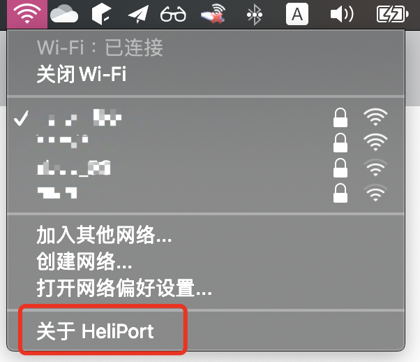

# 注意啦！

clover 版本 EFI 停止维护，未来主营 OpenCore EFI。

英特尔WiFi卡可以正常工作！！！

[去看看`itlwm`]（https://github.com/OpenIntelWireless/itlwm）

[WiFi驱动程序前端应用程序“ HeliPort”]（https://github.com/OpenIntelWireless/HeliPort）

非常感谢硬件WiFi卡驱动程序开发人员@zxystd！

Look at below:



## 更新日志

- [20-7-7] OpenCore EFI 已经完成.
- [20-7-5] 提供与时俱进的 OpenCore EFI 测试版.
- [20-7-5] 使用 virualsmc 替换了 fakesmc.
- [20-7-5] 电池和键盘功能键使用热补丁技术，不再依赖 dsdt.aml.
- [20-6-23] 支持 intel 原生蓝牙.
- [19-5-29] 增加 noTouchId.kext. 解决输入密码时，macos 认为指纹模块存在导致的卡顿.

## OpenCore 没有解决或者还没处理的部分

- HDMI 视频输出
- 触控屏驱动 (等我有空)

## OpenCore 使用注意事项

你需要自己生成 SMBIOS ([GenSMBIOS](https://github.com/corpnewt/GenSMBIOS)),
你可以参考指南：[coffee-lake-8th-gen](https://khronokernel.github.io/Opencore-Vanilla-Laptop-Guide/config.plist/coffee-lake-8th-gen.html#Platforminfo)

## ACPI文件描述

- SSDT-Battery.aml 电池电量信息修补程序。
- SSDT-keyboard.aml 键盘上的屏幕亮度调整按钮修复。
- SSDT_NVMe-Pcc.aml 用于屏蔽主硬盘驱动器位置上的PM981。 **如果您的PM981不是主硬盘驱动器，请不要使用它**。
- SSDT-dGPUT-Off.aml 阻止独立显卡加载并节省电量。
- SSDT-GPRW.aml & SSDT-PTSWAK.aml 休眠问题修复。
- SSDT-USBX.aml USB 电源注入。
- SSDT-PNLF-CFL.aml 屏幕亮度调整修复了热补丁。
- SSDT-PLUG.aml Cpu 电源管理使用 xcpm + hwp。
- SSDT-HPET.aml 使用 SSDTTime 修复(来自 Clover 的) IRQ 冲突，例如 FixIPIC，FixTMR，FixRTC，FixHPET 等。此补丁需要 config.plist ACPI 重命名配合。
- SSDT-SBUS-mchc.aml 修复了 macOS 中的 AppleSMBus 支持。
- SSDT-PMC.aml 所有 “真正的” 300 系列主板（不包括 Z370）都需要此 SSDT，它专门带回了 NVRAM 支持，并且对最终用户的配置很少。第10代主板不需要这些平台上的 NVRAM 原生的 SSDT。 **!!可能该补丁不需要**
- SSDT-RHUB.aml 因此，在 400 系列主板上，某些 OEM 破坏了ACPI规范，这导致启动进入 macOS 时出现问题。为了解决这个问题，我们要关闭 RHUB 设备并强制 macOS 手动重建端口。 **!!可能不需要**

## 使用 intel 原装卡蓝牙

默认屏蔽了 intel 原装卡蓝牙的 usb 口。 如果你需要使用 intel 原装网卡，自己修改 config.plist, 去掉对 `HS14` 的屏蔽。

```xml
<dict>
  <key>Arguments</key>
  <!-- 去掉 HS14 的屏蔽 -->
  <string>-lilubetaall -cdfon uia_exclude=HS14,HS05,HS06,USR1,USR2</string>
        ...
</dict>
```

## HDMI

- HDMI 视频输出（需要使用支援 displaylink 芯片的 usb 3.0 外置显卡，解决方案来自 [@Errrneist](https://github.com/Errrneist/Hackintosh-Thinkpad-X1-Extreme)）

## 无线网卡完美改造方案

[板卡设计图](https://github.com/zysuper/Thinkpad-X1-extreme-EFI/blob/master/doc/Wi-Fi%20bluethooth-zh.md)

## 旧式 Clover EFI

[clover 说明](./clover-zh s.md)

